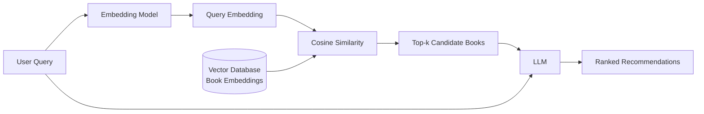

# Lunaria - A Demo Reading App

## Abstract

Lunaria is an AI-powered Android reading application that explores the use of large language models and retrieval-based techniques for personalized book recommendation. The system combines structured genre preferences and free-form user descriptions to generate recommendations, while comparing LLM-based, retrieval-augmented, and heuristic baseline approaches through ranking-based evaluation. The project is designed as an end-to-end AI engineering system, integrating mobile development, backend services, data storage, retrieval, model inference, and recommender evaluation.

## System Overview

### User Flow

After logging in, users complete a short reading-preference survey by selecting their favorite genres and optionally providing a free-text description of what they enjoy reading. These preferences are stored in the database alongside the application's book catalog. The backend then uses the stored user and book data to generate personalized recommendations, either by sending the catalog directly to the LLM or by using RAG to retrieve relevant candidate books before LLM-based ranking.

### Recommendation Pipeline

When RAG is used, the user's reading preferences are converted into an embedding and compared with precomputed book embeddings stored in the vector database. Cosine similarity is used to retrieve the top-k most relevant books, which are then passed to the LLM. The LLM analyzes these candidates together with the user's preferences and produces the final ranked recommendations.

## Recommendation Method Evaluation

To evaluate Lunaria's recommendation pipeline, three approaches were compared on a custom human-labeled benchmark:

- **Baseline**: a lightweight heuristic that ranks books by the number of matching favorite genres.
- **LLM-only**: `GPT-5 nano` receives the user's genre preferences, free-text preference description, and the full book catalog.
- **RAG + LLM**: `intfloat/multilingual-e5-small` retrieves the top 10 candidate books, which are then reranked by GPT-5 nano.

### Benchmark Setup

The benchmark contains 20 simulated users divided into four categories: **simple**, **constraint**, **semantic**, and **author-fan**. Two relevance-labeling policies were evaluated to reduce dependence on a single subjective definition of relevance. The first gives more importance to the user's free-text description, while the second prioritizes direct genre matching.

### Overall Results

#### Free-text-priority labels

| Method | Mean nDCG | Mean Normalized Precision | Mean Violation Rate |
| --- | ---: | ---: | ---: |
| LLM-only | **0.9609** | **0.9500** | **0.0000** |
| RAG + LLM | 0.8783 | 0.8317 | **0.0000** |
| Baseline | 0.8509 | 0.8425 | 0.1100 |

#### Genre-priority labels

| Method | Mean nDCG | Mean Normalized Precision | Mean Violation Rate |
| --- | ---: | ---: | ---: |
| LLM-only | **0.9443** | **0.9225** | **0.0000** |
| RAG + LLM | 0.8703 | 0.8092 | **0.0000** |
| Baseline | 0.8625 | 0.8825 | 0.1100 |

Changing the labeling policy affected the scores as expected: the baseline improved when genre matching received more importance, while the LLM-based approaches decreased slightly. However, the overall result remained similar, with the LLM-only method achieving the strongest ranking performance across both labeling policies.

### Results by User Type

For **simple users**, whose preferences contain only favorite genres, all three methods performed similarly. The baseline is already highly effective in this case because counting genre matches provides most of the information needed for a good recommendation. Using an LLM therefore provides relatively little additional value while requiring more computation and cost.

For **constraint users**, the advantage of having access to the free-text description becomes much clearer. These users explicitly mention genres they do not want to read. Both LLM-only and RAG + LLM avoided all labeled constraint violations in the evaluation, while the genre-only baseline frequently recommended books containing disliked genres. This suggests that free-text understanding is particularly useful when user preferences contain negative constraints that cannot be represented by favorite genres alone.

For **semantic users**, the LLM-only approach performed especially well when the relevance labels prioritized the meaning of the free-text description. When genre matching was given more importance, the baseline became more competitive. This shows that the relative advantage of an LLM depends on what information is considered important: semantic preference descriptions favor language-based reasoning, while strongly genre-oriented relevance can already be handled effectively by a simple heuristic.

For **author-fan users**, the LLM and RAG methods could use author preferences expressed in free text, while the baseline could not. RAG also benefited from author information being included in the embedded book representation, but its retrieval stage relies on cosine similarity rather than exact author matching. As a result, books from the preferred author could occasionally be ranked lower or excluded from the retrieved candidate set, which introduced some fluctuation in RAG performance for this user type. However, this group contains only two users, so the result should be treated as an observation rather than a general conclusion.

### Interpretation

The evaluation suggests that no single recommendation method is necessary for every user.

When a user provides only genre preferences, the heuristic baseline is a practical choice because it is fast, inexpensive, and already performs well. When a user also provides a free-text preference description, the LLM can use information that the baseline cannot represent directly, including disliked genres, semantic interests, preferred themes, and favorite authors.

For the current small catalog, the **LLM-only approach performs better overall than RAG + LLM** because the entire catalog can be included directly in the model context. RAG introduces a retrieval stage that can remove useful books before the LLM has a chance to rank them. Dense semantic retrieval also represents similarity rather than strict logical filtering, so mentioning a disliked genre can still make books from that genre semantically similar to the query.

RAG may become more useful as the catalog grows and providing every book to the LLM becomes inefficient or exceeds the available context window. Scalability was not evaluated in the current benchmark, so this remains an architectural motivation rather than a result demonstrated by this experiment.

### Applying the results to Lunaria

Based on the current evaluation, Lunaria uses a hybrid strategy:

- **Genre preferences only → Baseline recommender**
- **Genre preferences + free-text description → LLM-based recommender**
- **Large future catalogs (more than 30 books in database) → RAG can be introduced as a candidate-retrieval layer when full-catalog prompting is no longer practical**

(The 30-book threshold is a manually chosen heuristic, not an experimentally optimized value)  

This design keeps simple recommendation requests lightweight while using the LLM only when richer user information provides a meaningful advantage.