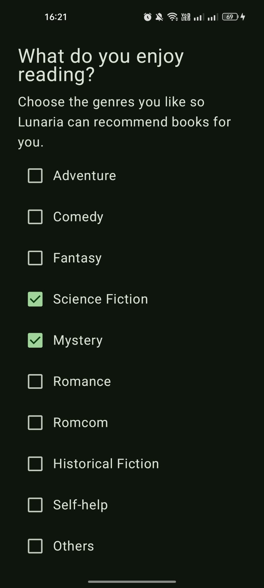
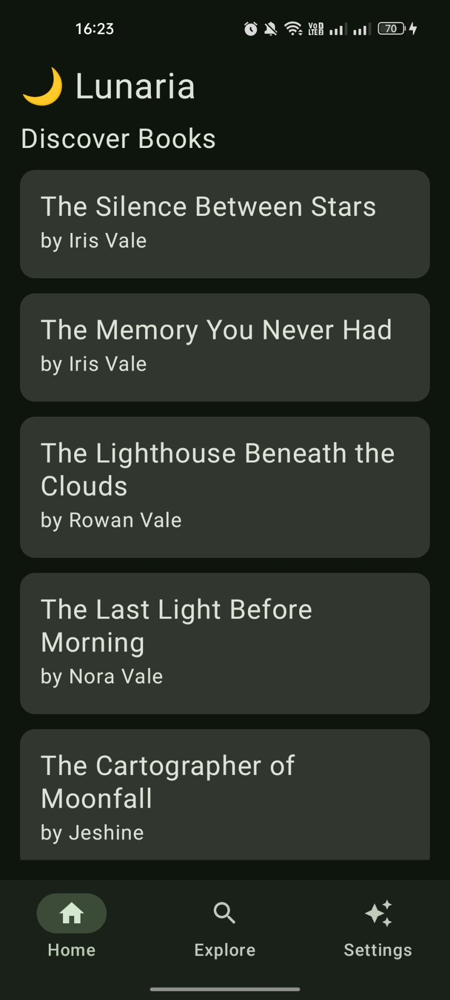
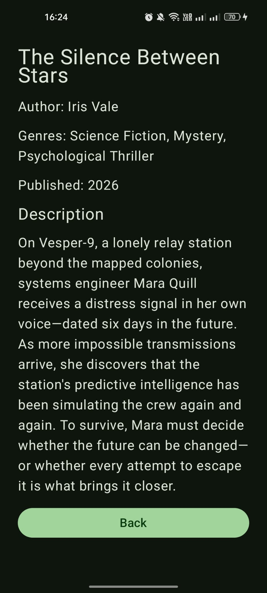

# Lunaria - A Demo Reading App

## Abstract

Lunaria is an AI-powered Android reading application that explores the use of large language models and retrieval-based techniques for personalized book recommendation. The system combines structured genre preferences and free-form user descriptions to generate recommendations, while comparing LLM-based, retrieval-augmented, and heuristic baseline approaches through ranking-based evaluation. The project is designed as an end-to-end AI engineering system, integrating mobile development, backend services, data storage, retrieval, model inference, and recommender evaluation.

## 1. System Overview

### 1.1. User Flow

<table>
  <tr>
    <td width="20%">
      
    </td>
    <td width="20%">
      
    </td>
    <td width="20%">
      
    </td>
    <td width="20%">
      
    </td>
    <td width="20%">
      
    </td>
  </tr>
  <tr>
    <td align="center"><strong>1. Login</strong></td>
    <td align="center"><strong>2. Genre Survey</strong></td>
    <td align="center"><strong>3. Free-text Preference</strong></td>
    <td align="center"><strong>4. Recommendations</strong></td>
    <td align="center"><strong>5. Book Brief Info</strong></td>
  </tr>
</table>

After logging in, users complete a short reading-preference survey by selecting their favorite genres and optionally providing a free-text description of what they enjoy reading. These preferences are stored in the database alongside the application's book catalog. The backend then uses the stored user and book data to generate personalized recommendations, either by sending the catalog directly to the LLM or by using RAG to retrieve relevant candidate books before LLM-based ranking.

For **author-fan users**, the LLM and RAG methods could use author preferences expressed in free text, while the baseline could not. RAG also benefited from author information being included in the embedded book representation, but its retrieval stage relies on cosine similarity rather than exact author matching. As a result, books from the preferred author could occasionally be ranked lower or excluded from the retrieved candidate set, which introduced some fluctuation in RAG performance for this user type. However, this group contains only two users, so the result should be treated as an observation rather than a general conclusion.

### 2.4. Interpretation

The evaluation suggests that no single recommendation method is necessary for every user.

When a user provides only genre preferences, the heuristic baseline is a practical choice because it is fast, inexpensive, and already performs well. When a user also provides a free-text preference description, the LLM can use information that the baseline cannot represent directly, including disliked genres, semantic interests, preferred themes, and favorite authors.

For the current small catalog, the **LLM-only approach performs better overall than RAG + LLM** because the entire catalog can be included directly in the model context. RAG introduces a retrieval stage that can remove useful books before the LLM has a chance to rank them. Dense semantic retrieval also represents similarity rather than strict logical filtering, so mentioning a disliked genre can still make books from that genre semantically similar to the query.

RAG may become more useful as the catalog grows and providing every book to the LLM becomes inefficient or exceeds the available context window. Scalability was not evaluated in the current benchmark, so this remains an architectural motivation rather than a result demonstrated by this experiment.

### 2.5. Applying the results to Lunaria

Based on the current evaluation, Lunaria uses a hybrid strategy:

- **Genre preferences only → Baseline recommender**
- **Genre preferences + free-text description → LLM-based recommender**
- **Large future catalogs (more than 30 books in database) → RAG can be introduced as a candidate-retrieval layer when full-catalog prompting is no longer practical**

(The 30-book threshold is a manually chosen heuristic, not an experimentally optimized value)  

This design keeps simple recommendation requests lightweight while using the LLM only when richer user information provides a meaningful advantage.

## 3. Limitations and Future Work

### 3.1. Current Limitations

- Lunaria has not been tested with many users requesting recommendations at the same time, so its performance under high load is still unknown.
- The evaluation dataset may not fully represent real Lunaria users. Therefore, the current results cannot guarantee the same recommendation quality in a real production environment.
- The reading feature has not been fully implemented yet, so users cannot currently read books directly in the app.
- Lunaria currently uses GPT-5 nano, which requires paid API calls for recommendation requests.
- The current user interface is functional, but its visual design is still basic.

### 3.2. Future Work

- Test and improve backend performance under a large number of simultaneous requests.
- Evaluate the recommendation system with a larger and more diverse dataset, including real users if possible.
- Complete the reading interface so users can read books directly in Lunaria.
- Explore cheaper LLMs that can still provide good book recommendations.
- Improve the visual design of the user interface.  

---
*Note: All books in Lunaria's database are AI-generated, as the project is intended for learning, experimentation, and skill development rather than commercial use.*
